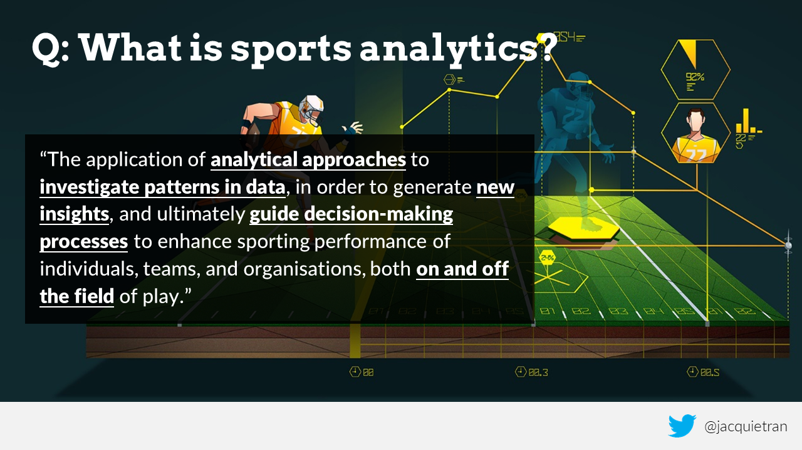
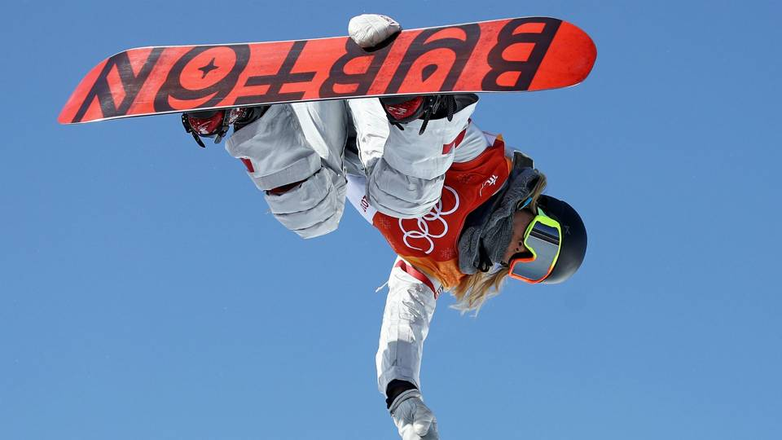
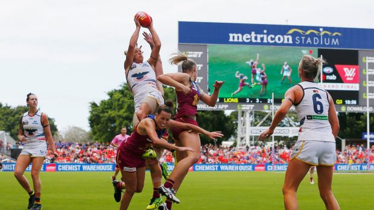
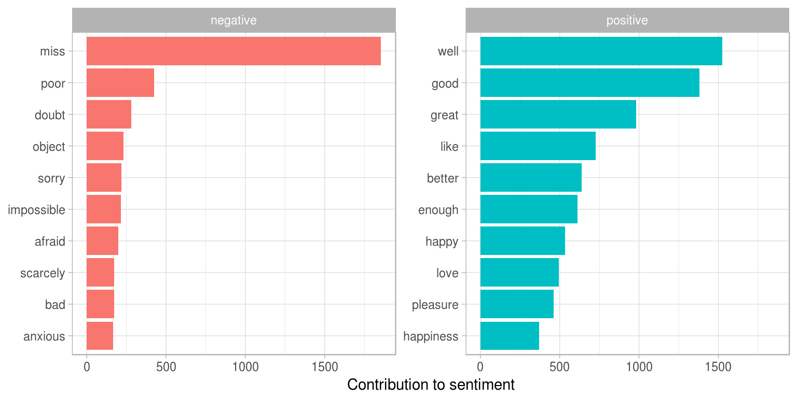
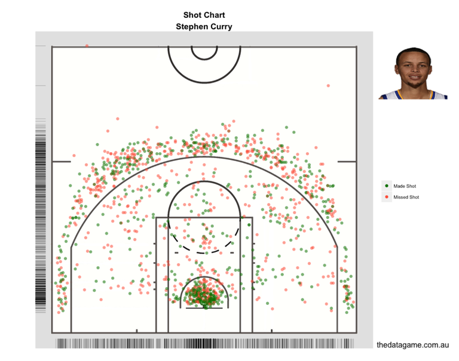

```{r setup, include=FALSE}

knitr::opts_chunk$set(echo = TRUE)

# Load libraries
library(dplyr)
library(ggplot2)

```

***

<center></center>

## A general workflow for sports analytics {.build}

Determine the need through collaboration

Articulate the need as a question

Scope out the 'minimum viable product'

Allow time for peer review

Communicate the findings in appropriate ways

# Why use R for sports analytics? | (or similar programming languages)

## Excel: The power and pitfalls of an 'all-in-one' tool {.build}

Data, analysis outputs, and visualisation are stored in one place

Data is easily manipulated - high risk of introducing errors

Point-and-click interface - manual repetition

Actions are not logged

Slow when working with large data sets or files storing many computations

Complex Excel workbooks can 'break' when shared with others

## The case for programming {.build}

Separation of data, analysis outputs, visualisations, and reports

Reproducible, transparent, and less error-prone workflow

Much faster for repetitive actions than point-and-click

Requires you to think early and often about data structure

Procedures are documented via scripts and command history

Build up a library of repeatable, adaptable procedures

# Now for some demos!

## First, a quick intro to R... {.build}

R is a statistical programming language, RStudio is an IDE for using R

Its most fundamental component is 'base R' but it is highly extensible

R is free and open source: users benefit from packages created by others

The R community is global and active - lots of help for when you get stuck!

# Demo 1 | Summarising data from the Winter Olympics

***

Demo 1 uses the `winter` data set [downloadable from this link](https://www.kaggle.com/the-guardian/olympic-games/data).

It includes all podium results from Winter Olympic Games that have taken place from 1924 to 2014, inclusive.

<br />
<center></center>

## Import data

``` {r demo1DataImport, message = FALSE}

# The readr package is efficient for reading (importing) of CSV files
library(readr)

# Read the data in
winter <- read_csv("winter.csv", col_names = TRUE, col_types = NULL)

```

## Check the data

``` {r demo1DataCheck}

head(winter)

```

## Subset the data {.build}

Let's say we are interested in comparing the **number of gold medals won** by **Canada, Norway, and Sweden** from the **last five Winter Olympic Games**.

We need to subset the data to focus only on:

- Gold medal results
- Athletes from Canada (CAN), Norway (NOR), or Sweden (SWE), and
- Results from the last five Winter Olympics (1998 to 2014)

## Subset the data

``` {r demo1DataSubset}

# The dplyr package includes useful data manipulation functions
library(dplyr)

# Subset the data
goldMedalComparison <- winter %>%
  filter(Medal == "Gold"
         & Country %in% c("CAN", "NOR", "SWE")
         & Year >= 1998)

```

## Check the data

``` {r demo1DataSubsetCheck}

goldMedalComparison

```

## Wrangle the data {.build}

In the `winter` data set, the data is structured such that **one row is one medal-winning athlete**.

However...

- Team events (e.g., bobsleigh) comprise multiple athletes, and
- Within teams that achieve a podium finish, each athlete is awarded a medal.

For this analysis, we need to wrangle the data to get it into a format where **one row represents one gold medal per event** (rather than per athlete).

## Wrangle the data

``` {r demo1DataWranglePart1}

# Create a new variable to identify each unique event
goldMedalComparison$uniqueEventID <-
  paste(goldMedalComparison$Year, goldMedalComparison$Sport,
        goldMedalComparison$Discipline, goldMedalComparison$Country,
        goldMedalComparison$Gender, goldMedalComparison$Event, sep="_")

```

## Wrangle the data

``` {r demo1DataWranglePart2}

goldMedalComparison %>%
  select(uniqueEventID)

```

## Wrangle the data

``` {r demo1DataWranglePart3}

# Identify duplicates
goldMedalComparison$duplicates <- duplicated(goldMedalComparison$uniqueEventID)

goldMedalComparison %>%
  select(uniqueEventID, duplicates)

```

## Wrangle the data

``` {r demo1DataWranglePart4}

# Remove duplicates from the data
# and remove temporary variables used for identifying duplicates
goldMedalComparison <- goldMedalComparison %>%
  filter(duplicates == FALSE) %>%
  select(-uniqueEventID, -duplicates)

```

## Wrangle the data

``` {r demo1DataWranglePart5}

goldMedalComparison %>%
  select(Year, Sport, Country, Event)

```

## Calculate summary statistics

The data is now in a format that is ready for calculating summary statistics.

For instance, we can tabulate the total number of gold medals won by Canada, Norway, and Sweden at each of the Winter Games since 1998.

## Calculate summary statistics

``` {r demo1SummaryStatsPart1, message = FALSE}

# The reshape2 package is useful for manipulating data
# from long-to-wide format and vice versa
library(reshape2)

# Calculate total number of gold medals per team per Winter Games
goldMedalTotals <- goldMedalComparison %>%
  group_by(Year, City, Country) %>%
  summarise(goldMedalTotal = length(Medal)) %>%
  ungroup()

# Reshape the data from long-to-wide format for tabulating
goldMedalTotalsWide <- dcast(goldMedalTotals,
                             Year + City ~ Country,
                             value.var = "goldMedalTotal")

```

## Calculate summary statistics {.build}

``` {r demo1SummaryStatsPart2}

# Check the reshaped data
goldMedalTotalsWide

```

``` {r demo1SummaryStatsPart3}

# NAs appear in the data because Sweden did not win any gold medals
# at the 1998 and 2002 Winter Games

# Replace these NAs with zeroes
goldMedalTotalsWide$SWE[is.na(goldMedalTotalsWide$SWE)] <- 0

```

## Calculate summary statistics

``` {r demo1SummaryStatsPart4}

# The DT package is used to display interactive tables in HTML documents
library(DT)

# Display the table
datatable(goldMedalTotalsWide, options = list(dom = 't'), rownames = FALSE)

```

## Calculate summary statistics {.build}

We can use the data frame we've just created - gold medal totals per team per Games - to calculate the median number of gold medals won by Canada, Norway, and Sweden at the last five Games.

``` {r demo1SummaryStatsPart5}

goldMedalMedians <- goldMedalTotalsWide %>%
  summarise(CAN = median(CAN),
            NOR = median(NOR),
            SWE = median(SWE))

goldMedalMedians

```

# Demo 2 | Visualising AFLW data

***

For demo 2, we will use data from season 1 of the AFLW to show how sports data can be visualised using R.

<center></center>

## Import the data

``` {r demo2DataImport, message = FALSE}

# This data was obtained from this Github repository:
# https://github.com/ropenscilabs/ozwomensport/tree/master/AFLW
aflwTeamStats <- read_csv("teams.csv", col_names = TRUE, col_types = NULL)

head(aflwTeamStats)

```

## Subset the data

Let's compare some basic stats across clubs. First, we need to prepare the data.

``` {r demo2DataSubset}

aflwTeamStats <- aflwTeamStats %>%
  filter(Club != "All Clubs")

```

## Plot the data

``` {r demo2BuildPlot1}

# The ggplot2 package is widely used for plotting in R
# It uses a layer-by-layer approach to building plots
library(ggplot2)

# Sort by average kicks per game
aflwTeamStats <- aflwTeamStats[order(aflwTeamStats$Kicks), ]

# Build the plot
p <- ggplot(aflwTeamStats, aes(x = reorder(Club, -Kicks), y = Kicks, fill = Club))
p <- p + facet_wrap(~Year, nrow = 1)
p <- p + geom_bar(stat = "identity")
p <- p + scale_y_continuous(
  limits = c(0,150), breaks = seq(0,150, by = 25))
p <- p + labs(title = "Comparing average kicks per game across AFLW teams",
              x = "Club",
              y = "Average kicks per game")
p <- p + theme(legend.position = "none",
               axis.text.x  = element_text(angle = 90, vjust = 0.5))
aflwKicksPlot <- p

```

## Plot the data

``` {r demo2ShowPlot1, echo = FALSE, fig.width = 7, fig.height = 5}

aflwKicksPlot

```

# Other neat things you can do in R

## Statistical analyses {.build}

This presentation is _not_ a deep dive into statistics, but R is more than capable of running a vast array of stats including:

- Hypothesis testing techniques
- Effect sizes
- Mixed models
- Regression and classification
- Network analysis
- Time series analysis
- And much much more...

## Text mining

<center><a href="https://www.tidytextmining.com/sentiment.html" target="_blank"></a></center>

## Geospatial plots

<center><a href="https://twitter.com/marcus_volz/status/944492030117363713" target="_blank"></a></center>

## Geospatial plots

<center><a href="https://thedatagame.com.au/2015/09/27/how-to-create-nba-shot-charts-in-r/" target="_blank"></a></center>

## Interactive dashboards

<center><a href="http://lenkiefer.com/chartbooks/jan2017/mortgage_rate_viewer_jan_2017.html" target="_blank"></a></center>

***

<center></center>
<br />
<center>[https://github.com/jacquietran/acu-gcpa-2018-02](https://github.com/jacquietran/acu-gcpa-2018-02)</center>
<br />
<hr />
<br />
<center>Dr Jacquie Tran | @jacquietran | [https://www.jacquietran.com](https://www.jacquietran.com)</center>

# Appendix 1: Learning R

## Starter resources

[Try R](http://tryr.codeschool.com): An in-the-browser tutorial for getting to know the R language - no software installation needed.

['Introduction to R'](www.datacamp.com/courses/free-introduction-to-r): Free course on [Data Camp](https://www.datacamp.com).

['R for Data Science'](http://r4ds.had.co.nz/), by Garrett Grolemund & Hadley Wickham.

['Data wrangling, exploration, and analysis with R'](http://stat545.com/): Course materials from a unit taught at the University of British Columbia by Prof Jenny Bryan.

['R for data analysis and visualisation'](http://www.datacarpentry.org/R-ecology-lesson/index.html): Data Carpentry lesson using ecology data

[The Data Science Guide](http://www.datasciguide.com/find-content-2/): A useful resource for finding content all over the web for learning different data science skills and programming languages. You can tailor your search to your current level of expertise in a given domain.

## Transitioning from Excel to R

['R for Excel Users'](http://blog.shotwell.ca/2017/02/02/r-for-excel-users/): Blog post by Gordon Shotwell

['Introduction to R for Excel Users'](https://tomhopper.me/2016/05/03/r-for-excel-users/): Free ebook by Tom Hopper

# Appendix 2: The R community

## The R community {.build}

Follow the [#rstats hashtag on Twitter](https://twitter.com/search?q=%23rstats&src=typd)

Many prominent R users and developers have blogs and / or tweet regularly. Here are some of my favourites:

@JennyBryan   |   @ma_salmon   |   @alice_data   |   @dataandme   |   @visnut   |   @kierisi   |   @thomasp85   |   @xieyihui   |   @drob   |   @juliasilge

Join, read, and contribute to the R Studio Community discussions: [https://community.rstudio.com/](https://community.rstudio.com/)

You can discover lots of weird, wonderful, and useful R packages and repositories on Github: [https://github.com/trending/r](https://github.com/trending/r)

# Appendix 3: Sports data sets

## 'Ready to analyse'

[AFLW data](https://github.com/ropenscilabs/ozwomensport/tree/master/AFLW) stored on Github

[ATP and WTA tennis data](https://github.com/skoval/deuce), accessible via the R package `deuce`

[Olympic Sports and Medals, 1896-2014](https://www.kaggle.com/the-guardian/olympic-games/data) collated by The Guardian

[NBA, NFL, MLB, and soccer data](https://github.com/fivethirtyeight/data) from [FiveThirtyEight](https://fivethirtyeight.com)

[NFL play-by-play data](https://github.com/maksimhorowitz/nflscrapR), accessible via the R package `nflscrapR`

MLB data from [Lahman's Baseball Database](http://seanlahman.com/baseball-archive/statistics/)

[Cricket data](https://github.com/ropenscilabs/cricinfo), accessible via the R package `cricinfo`

## Needs scraping / cleaning

[WNBA player and game data](http://www.wnba.com/stats/) from WNBA.com

AFL match statistics from [AFL Tables](https://afltables.com/afl/afl_index.html)

AFL draft and trade data from [Draft Guru](https://www.draftguru.com.au/)

[NCAA men's college basketball data](https://www.sports-reference.com/cbb/) from [Sports Reference](https://www.sports-reference.com)

[NCAA men's college football data](https://www.sports-reference.com/cfb/) from [Sports Reference](https://www.sports-reference.com)

# Other references and resources

## References and resources

[Introduction to dplyr](http://stat545.com/block009_dplyr-intro.html)

[An introduction to reshape2](http://seananderson.ca/2013/10/19/reshape.html)